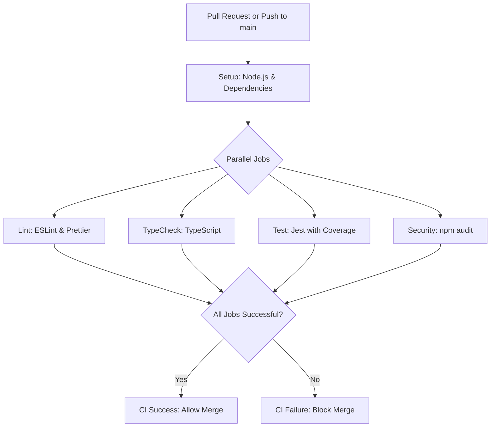

# Implementation Plan: Implement Core CI Pipeline with Quality Gates

## Objective

Create a comprehensive GitHub Actions CI pipeline that automates the verification of code quality standards, preventing regressions, enforcing standards (linting, type checking, tests, security), and aligning with our mandatory Automation Everywhere philosophy.

## Architecture Blueprint

- **CI Workflow File**: `.github/workflows/ci.yml`

  - Single Responsibility: Define and orchestrate the CI pipeline jobs and steps
  - Infrastructure: GitHub Actions

- **Quality Gate Configurations**:
  - ESLint configuration (`.eslintrc.js`) - Already exists
  - TypeScript configuration (`tsconfig.json`) - Already exists
  - Jest configuration (`jest.config.js`) - Already exists
  - Security scanning configuration (will use npm audit)

## CI Pipeline Flow

## Detailed Implementation Steps

1. **Create GitHub Actions Workflow File**:

   - Create directory structure: `.github/workflows/`
   - Create main workflow file: `.github/workflows/ci.yml`
   - Configure workflow to trigger on:
     - Pull requests targeting main branch
     - Direct pushes to main branch

2. **Setup Job Configuration**:

   - Define Node.js version (latest LTS)
   - Configure dependency caching for faster builds
   - Install dependencies using npm

3. **Implement Linting Job**:

   - Run ESLint: `npm run lint`
   - Run Prettier check: `npm run format:check`
   - Fail job if any linting errors occur

4. **Implement TypeScript Check Job**:

   - Run TypeScript compiler in check mode: `npm run typecheck`
   - Fail job if any type errors are found

5. **Implement Testing Job**:

   - Run Jest tests with coverage: `npm test -- --coverage`
   - Configure Jest coverage thresholds in `jest.config.js`:
     - Overall coverage: 85%
     - Core logic (when refactored): 95%
   - Upload coverage report as artifact
   - Fail job if any tests fail or coverage thresholds aren't met

6. **Implement Security Scanning Job**:

   - Run npm audit: `npm audit --audit-level=high`
   - Fail job if high or critical vulnerabilities are found

7. **Verify Workflow Functionality**:
   - Create test branch with a pull request to verify workflow triggers
   - Verify all jobs run correctly and report accurate results

## Testing Strategy

- **Self-Testing**: The CI workflow itself is tested through actual usage:

  - Test the workflow by creating a test PR with a deliberate failing test
  - Verify the PR is blocked from merging
  - Fix the test and verify the PR can be merged

- **Test Coverage**: Ensure the CI workflow adequately tests the codebase:
  - Verify linting catches style issues
  - Verify type checking catches type errors
  - Verify test coverage reports are accurate
  - Verify security scanning identifies known vulnerabilities

## Risk Assessment and Mitigation

| Risk                                                   | Severity | Mitigation                                                                                   |
| ------------------------------------------------------ | -------- | -------------------------------------------------------------------------------------------- |
| CI pipeline too strict initially, blocking valid code  | Medium   | Start with reasonable thresholds that match current codebase state; tighten gradually        |
| CI pipeline too slow, impacting developer productivity | Medium   | Implement caching, parallelize jobs, optimize test execution                                 |
| Security scanning produces false positives             | Low      | Properly configure audit level; document process for vulnerability assessment                |
| CI workflow permissions issues                         | Low      | Set appropriate permissions in workflow file; test on a branch first                         |
| Test coverage thresholds too high for legacy code      | Medium   | Set realistic coverage goals based on current coverage; establish plan to increase over time |

## Success Criteria

1. GitHub Actions workflow successfully runs on all PRs to main branch
2. Workflow blocks merges when quality gates fail:
   - Linting errors
   - Type errors
   - Test failures
   - Coverage below thresholds
   - High/critical security vulnerabilities
3. Workflow provides clear feedback on failure causes
4. Build times are reasonable (<5 minutes for complete run)

## Future Enhancements (Post-Implementation)

1. Add build step for compiled assets
2. Add deployment workflow for compiled extension
3. Implement automated release process with version bumping
4. Add visual regression testing
5. Implement Dependabot for automated dependency updates

## Estimated Timeline

- Setup GitHub Actions workflow structure: 1 hour
- Configure and test each job (linting, type checking, testing, security): 3 hours
- Final integration testing and documentation: 1 hour
- Total: ~5 hours

## Branch Name

`ci/implement-core-ci-pipeline`
